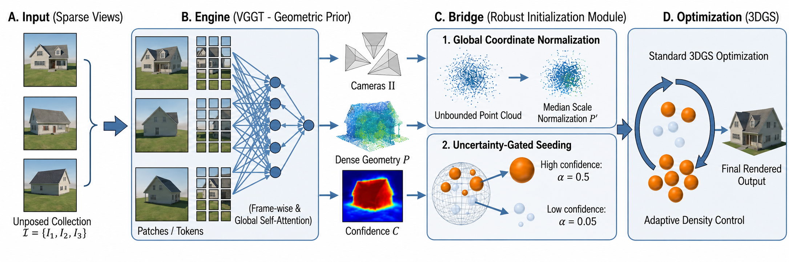

<div align="center">

# VGGT-Based COLMAP-Free Initialization for Sparse-View 3D Gaussian Splatting

[](#citation)
[](LICENSE)

**Shreeya Venkatraman\* · Yuvan Raj Krishna\* · Jiji C V**

Dept. of CSE, Shiv Nadar University Chennai

\*Joint first authors



</div>

## Overview

Sparse-view 3D Gaussian Splatting fails when COLMAP cannot initialize — at 3 training views, COLMAP succeeds on only **1 of 7** Mip-NeRF 360 scenes. We replace SfM with a single feed-forward [VGGT](https://github.com/facebookresearch/vggt) pass plus a lightweight **Bridge**: median-distance global scale normalization and confidence-seeded initial opacities (α ∈ [0.05, 0.5]). The result initializes **every scene at every view count** (Mip-NeRF 360, Tanks & Temples, MVImgNet) in ~10 s, with standard 3DGS optimization left untouched.

## Installation

```bash
git clone https://github.com/<org>/<repo>.git
cd <repo>

conda create -n vggt3dgs python=3.12 -y && conda activate vggt3dgs
pip install -r requirements.txt
git clone https://github.com/facebookresearch/vggt.git repos/vggt && pip install -e repos/vggt   # VGGT-1B downloads from HF on first run

# 3DGS CUDA extensions (upstream submodules of the vendored fork)
git clone -b dr_aa https://github.com/graphdeco-inria/diff-gaussian-rasterization --recursive
git -C diff-gaussian-rasterization apply ../patches/diff-gaussian-rasterization-gcc13.patch  # GCC ≥ 13 fix
pip install ./diff-gaussian-rasterization
pip install git+https://gitlab.inria.fr/bkerbl/simple-knn.git
```

COLMAP (for the train-only baseline) must be on `PATH`.

## Data

Place the [Mip-NeRF 360 dataset](https://jonbarron.info/mipnerf360/) under `data/mipnerf360/<scene>/` (7 scenes: bicycle, bonsai, counter, garden, kitchen, room, stump — full-resolution `images/` plus the official `sparse/0` reference). Evaluation uses the standard every-8th-image held-out split (test sets are generated automatically and are identical at every view count).

## Reproducing the paper

```bash
# Ours (paper method) — all scenes, n = 3/6/9/12
python scripts/run_view_sweep.py --mode sparse_fixed_trainonly_init_ref \
  --paper_config configs/spcom_camera_ready.yaml \
  --conditions vggt_seedfilter0_10k_sh3 --n_train 3 6 9 12 --scene <scene>

# COLMAP train-only baseline
python scripts/run_view_sweep.py --mode sparse_fixed_trainonly_init_ref \
  --paper_config configs/spcom_camera_ready.yaml \
  --conditions colmap_trainonly_10k_sh3 --n_train 3 6 9 12 --scene <scene>
```

Per-scene results land in `outputs_spcom_camera_ready/paper_eval/.../results.json`. Pose-accuracy metrics: `python eval/compute_ate_spcom.py` and `eval/compute_rpe_spcom.py`. See [REPRODUCE.md](REPRODUCE.md) for condition-name semantics, expected runtimes (~10 s VGGT, ~2.3 min per scene/view-count cell on one RTX 4080 SUPER), and the full expected-numbers table.

### Expected results (Mip-NeRF 360, PSNR, COLMAP-surviving scene subsets)

| n | COLMAP (Succ.) | Ours | Ours, all 7 scenes |
|---|---|---|---|
| 3 | 9.60 (1/7) | **10.80** | 12.34 |
| 6 | 10.33 (2/7) | **15.35** | 14.12 |
| 9 | 12.65 (6/7) | **14.61** | 14.88 |
| 12 | 14.36 (6/7) | **15.91** | 15.96 |

## Citation

```bibtex
@inproceedings{venkatraman2026vggt,
  title     = {{VGGT}-Based {COLMAP}-Free Initialization for Sparse-View {3D} Gaussian Splatting},
  author    = {Venkatraman, Shreeya and Krishna, Yuvan Raj and C V, Jiji},
  booktitle = {Proc. IEEE SPCOM},
  year      = {2026}
}
```

## License

Our code (`pipelines/`, `scripts/`, `eval/`, `configs/`) is released under **Apache-2.0**. The vendored `repos/gaussian-splatting/` directory is a fork of [graphdeco-inria/gaussian-splatting](https://github.com/graphdeco-inria/gaussian-splatting) and remains under its original **Inria/MPII non-commercial research license** (see `repos/gaussian-splatting/LICENSE.md`). VGGT is installed from upstream under Meta's VGGT license. See [NOTICE](NOTICE).

## Acknowledgements

Built on [VGGT](https://github.com/facebookresearch/vggt) (Wang et al., CVPR 2025) and [3D Gaussian Splatting](https://github.com/graphdeco-inria/gaussian-splatting) (Kerbl et al., SIGGRAPH 2023). Cross-dataset evaluation follows the [InstantSplat](https://github.com/NVlabs/InstantSplat) scene splits; the Mip-NeRF 360 benchmark protocol follows [DropGaussian](https://github.com/DCVL-3D/DropGaussian_release).
